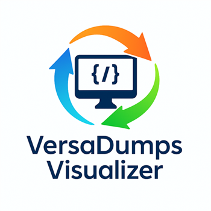
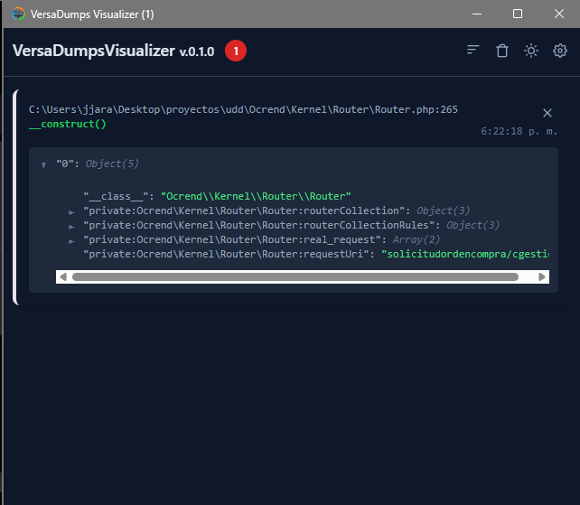
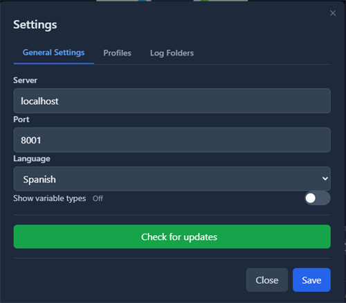
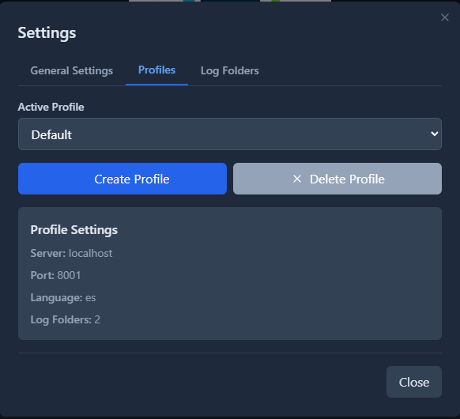
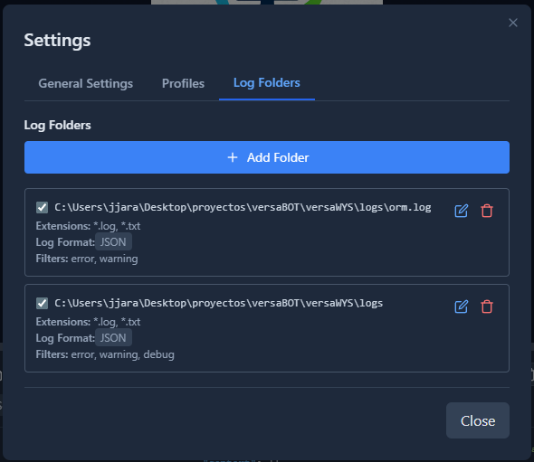

# VersaDumps Visualizer

<p align="center">
  
</p>

## 📋 Descripción

VersaDumps Visualizer es una aplicación de escritorio multiplataforma para visualizar y depurar datos en tiempo real, diseñada principalmente para aplicaciones backend (como PHP, Node.js, Python, etc.). La aplicación inicia un servidor HTTP local que escucha payloads JSON entrantes y los muestra en una interfaz interactiva, además de monitorear archivos de log del sistema en tiempo real.

## ✨ Características principales

### 🎯 Core Features
- 🌓 **Temas claro y oscuro** con soporte persistente
- 🌍 **Internacionalización (i18n)**: Soporte multiidioma (Español e Inglés)
- 👤 **Perfiles múltiples**: Gestiona diferentes configuraciones y cambia entre ellas fácilmente
- 🔄 **Visualización en tiempo real** de dumps HTTP con controles de ordenación (más recientes/más antiguos primero)
- 📊 **Exploración interactiva** de datos JSON anidados con árbol expandible
- 📱 **Diseño responsive** con enfoque mobile-first

### 📂 Monitoreo de Archivos de Log
- 📁 **Monitoreo de carpetas** en tiempo real con fsnotify
- 🔍 **Filtrado avanzado**:
  - Por extensión de archivo (*.log, *.txt, etc.)
  - Por nivel de log (error, warning, info, debug, success)
  - Por contenido de texto en tiempo real
- 📝 **Soporte de formatos**: JSON y texto plano
- 🔄 **Detección automática de rotación** de logs
- 🎨 **Resaltado de sintaxis** para archivos JSON con colores diferenciados
- 📊 **Contador de líneas** totales y filtradas
- 🗑️ **Gestión completa**: Limpiar logs, abrir carpetas, editar configuración

### 🖥️ Interfaz de Usuario
- 🔲 **Vista dividida redimensionable**:
  - Panel superior: Dumps HTTP (60% altura por defecto)
  - Panel inferior: Visor de archivos de log (40% altura por defecto)
  - Separador ajustable con límites 30%-70%
- 🗑️ **Gestión de logs**: Borrar todos los logs o eliminarlos individualmente
- 📊 **Indicador de estado del servidor** (online/offline/checking)
- 🔔 **Badge en barra de tareas** (Windows) mostrando el número de mensajes recibidos
- 🔍 **Título de ventana dinámico** que muestra el contador de mensajes
- 💾 **Posición de ventana guardada** (restaura tamaño y posición al reiniciar)

### 🔄 Sistema de Actualizaciones
- ✨ **Actualizaciones automáticas** desde GitHub Releases
- 📥 **Descarga e instalación** de nuevas versiones
- 🔔 **Notificaciones** de actualizaciones disponibles
- 📝 **Changelog** visible en la aplicación

<p align="center">
  
</p>

### 📸 Capturas de pantalla

<div align="center">

**Configuración de Perfiles**



**Gestión de Carpetas de Log**



**Personalización de Tema e Idioma**



</div>

## 🧰 Stack tecnológico

### Backend
- **Go** 1.21+
- **Wails v2** - Framework de aplicaciones de escritorio
- **fsnotify** - Monitoreo de sistema de archivos
- **yaml.v3** - Manejo de configuración

### Frontend
- **Vue.js 3** - Framework JavaScript progresivo
- **Tailwind CSS** - Framework de CSS utility-first
- **Vite** - Herramienta de build ultrarrápida

### Herramientas
- **PowerShell** - Scripts de automatización y setup
- **NSIS** - Instalador para Windows
- **GitHub Actions** - CI/CD automatizado

## 📁 Estructura del proyecto

```
/versaDumps
├── .github/
│   └── workflows/          # CI/CD pipelines
├── app/
│   ├── build/
│   │   ├── bin/
│   │   │   ├── VersaDumps.exe       # Ejecutable final
│   │   │   └── config.yml           # Configuración en tiempo de ejecución
│   │   └── appicon.png              # Icono de la aplicación
│   ├── cmd/                         # Comandos CLI
│   ├── frontend/
│   │   ├── src/
│   │   │   ├── assets/              # Recursos estáticos
│   │   │   ├── components/          # Componentes Vue
│   │   │   │   ├── ConfigModal.vue          # Modal de configuración
│   │   │   │   ├── Icon.vue                 # Sistema de iconos
│   │   │   │   ├── JsonTreeView.vue         # Visualizador JSON
│   │   │   │   ├── JsonTreeViewNode.vue     # Nodos del árbol JSON
│   │   │   │   ├── LineHr.vue               # Separador horizontal
│   │   │   │   ├── LogFileViewer.vue        # Visor de archivos de log
│   │   │   │   ├── LogFoldersManager.vue    # Gestor de carpetas de log
│   │   │   │   ├── LogItem.vue              # Item individual de log
│   │   │   │   └── UpdateNotification.vue   # Notificación de actualización
│   │   │   ├── i18n/                # Internacionalización
│   │   │   │   ├── en.js            # Traducciones en inglés
│   │   │   │   ├── es.js            # Traducciones en español
│   │   │   │   └── index.js         # Configuración i18n
│   │   │   ├── App.vue              # Componente principal
│   │   │   ├── index.css            # Estilos globales
│   │   │   └── main.js              # Punto de entrada
│   │   ├── index.html
│   │   ├── package.json
│   │   ├── tailwind.config.js
│   │   └── vite.config.js
│   ├── tools/                       # Herramientas auxiliares
│   ├── app.go                       # Lógica principal de la app
│   ├── badge_windows.go             # Badge de barra de tareas (Windows)
│   ├── badge_darwin.go              # Badge para macOS
│   ├── badge_unix.go                # Badge para Linux/Unix
│   ├── config.go                    # Gestión de configuración
│   ├── config.yml                   # Archivo de configuración
│   ├── logwatcher.go                # Sistema de monitoreo de logs
│   ├── main.go                      # Punto de entrada
│   ├── server.go                    # Servidor HTTP
│   ├── updater.go                   # Sistema de actualizaciones
│   ├── updater_windows.go           # Instalador de actualizaciones (Windows)
│   ├── updater_unix.go              # Instalador de actualizaciones (Unix)
│   ├── go.mod
│   └── wails.json                   # Configuración de Wails
├── art/                             # Recursos de arte
├── phpBack/                         # Ejemplo de integración con PHP
│   └── composer.json                # versadumps-php package
├── test-logs/                       # Logs de prueba
├── CHANGELOG.md                     # Historial de cambios
├── ICONS.md                         # Documentación de iconos
├── README.md                        # Este archivo
├── RELEASE.md                       # Notas de release
├── TODO.md                          # Lista de tareas
├── create-installer.ps1             # Script para crear instalador
├── release.ps1                      # Script de release
├── setup-icons.ps1                  # Setup de iconos (Windows)
├── setup-icons.sh                   # Setup de iconos (Unix/macOS)
└── update-version.ps1               # Script de actualización de versión
```

## 📊 Estructura de datos

### Payload HTTP

La aplicación espera un payload JSON con la siguiente estructura:

```json
{
  "frame": {
    "file": "/ruta/al/archivo.php",
    "line": 123,
    "function": "miFuncion"
  },
  "context": "{\"clave\":\"valor\"}"
}
```

- `frame`: Objeto que contiene la ubicación del código fuente
  - `file`: Ruta del archivo
  - `line`: Número de línea
  - `function`: Nombre de la función
- `context`: Una **cadena** que contiene un objeto JSON para inspección detallada

### Configuración (config.yml)

```yaml
active_profile: Default
profiles:
  - name: Default
    server: localhost
    port: 9191
    theme: dark
    language: es
    show_types: true
    log_folders:
      - path: C:\logs\app
        extensions:
          - "*.log"
          - "*.txt"
        filters:
          - error
          - warning
        enabled: true
        format: text
      - path: C:\logs\json
        extensions:
          - "*.json"
        filters: []
        enabled: true
        format: json
  - name: Production
    server: 0.0.0.0
    port: 8080
    theme: light
    language: en
    show_types: false
    log_folders: []
window_position:
  x: 100
  y: 100
  width: 1200
  height: 800
```

#### Configuración de Perfiles

- `active_profile`: Nombre del perfil activo
- `profiles`: Array de perfiles de configuración
  - `name`: Nombre del perfil
  - `server`: Dirección del servidor HTTP (localhost, 0.0.0.0, etc.)
  - `port`: Puerto en el que escuchará el servidor
  - `theme`: Tema de la interfaz (`dark` o `light`)
  - `language`: Idioma de la interfaz (`es` o `en`)
  - `show_types`: Mostrar tipos de datos en el visor JSON
  - `log_folders`: Carpetas de log a monitorear
    - `path`: Ruta absoluta de la carpeta
    - `extensions`: Extensiones de archivo a monitorear (soporta wildcards)
    - `filters`: Filtros por nivel de log (vacío = todos)
    - `enabled`: Si el monitoreo está activo
    - `format`: Formato del log (`text` o `json`)

- `window_position`: Posición y tamaño de la ventana (opcional)
  - `x`, `y`: Posición en pantalla
  - `width`, `height`: Dimensiones de la ventana

## 🚀 Cómo construir y ejecutar

### Requisitos previos

- **Go** 1.21 o superior
- **Node.js** 16 o superior
- **Wails CLI** v2
  ```bash
  go install github.com/wailsapp/wails/v2/cmd/wails@latest
  ```

### Desarrollo

1. Navega al directorio `app`
   ```bash
   cd app
   ```

2. Ejecuta Wails en modo desarrollo
   ```bash
   wails dev
   ```
   - Proporciona recarga en caliente
   - Ideal para desarrollo activo
   - Devtools del navegador disponibles

### Producción

1. Navega al directorio `app`
   ```bash
   cd app
   ```

2. Construye la aplicación
   ```bash
   wails build
   ```
   - Crea el ejecutable final y autónomo en `app/build/bin`

3. Para crear el instalador de Windows (desde la raíz del proyecto)
   ```powershell
   .\create-installer.ps1
   ```

### Ejecución

1. Coloca `config.yml` en el mismo directorio que el ejecutable (se crea automáticamente con valores por defecto si no existe)
2. Ejecuta el archivo ejecutable `VersaDumps.exe` (Windows) o `VersaDumps` (Linux/macOS)

## 🔧 Configuración

### Configuración de Iconos

Para personalizar el icono de la aplicación:

1. Reemplaza `app/build/appicon.png` con tu icono (recomendado: 256x256px PNG)
2. Ejecuta el script de configuración:
   ```powershell
   # En Windows
   .\setup-icons.ps1
   ```
   ```bash
   # En Unix/macOS/Linux
   ./setup-icons.sh
   ```
3. Recompila la aplicación con `wails build`

Para más detalles, consulta [ICONS.md](ICONS.md).

### Gestión de Perfiles

Puedes gestionar perfiles directamente desde la interfaz:

1. Haz clic en el icono de configuración (⚙️)
2. Selecciona el perfil que deseas usar o crea uno nuevo
3. Los cambios se guardan automáticamente en `config.yml`

### Monitoreo de Logs

Para configurar carpetas de log:

1. Abre el panel de configuración
2. Ve a la sección "Log Folders"
3. Agrega carpetas con sus respectivas configuraciones
4. Los logs se mostrarán automáticamente en el panel inferior

## 🔌 Integración con PHP

VersaDumps incluye un paquete PHP para facilitar la integración:

### Instalación

```bash
composer require versadumps-php/versadumps-php
```

### Uso básico

```php
<?php
require_once 'vendor/autoload.php';

use VersaDumps\VersaDumps;

// Configurar el servidor (opcional, por defecto: localhost:9191)
VersaDumps::config([
    'host' => 'localhost',
    'port' => 9191
]);

// Hacer un dump de datos
$data = ['nombre' => 'John', 'edad' => 30];
VersaDumps::dump($data);

// Dump con metadata adicional
VersaDumps::dump($data, 'Usuario procesado');
```

Para más información, consulta el repositorio [versadumps-php](https://github.com/kriollo/versadumps-php).

## 💻 Interfaz de usuario

### Componentes principales

- **App.vue**: Componente raíz que gestiona el estado global de la aplicación
- **LogItem.vue**: Muestra una entrada de dump HTTP individual
- **JsonTreeView.vue** y **JsonTreeViewNode.vue**: Renderizan el contexto JSON explorable
- **LogFileViewer.vue**: Visualizador de archivos de log en tiempo real
- **LogFoldersManager.vue**: Gestor CRUD de carpetas de log
- **ConfigModal.vue**: Modal de configuración y gestión de perfiles
- **UpdateNotification.vue**: Notificación de actualizaciones disponibles

### Sistema de iconos

La aplicación incluye un sistema de iconos personalizado:
- `gear` - Configuración
- `trash` - Eliminar
- `sun` / `moon` - Cambio de tema
- `sort` - Ordenar
- `file` - Archivos
- `edit` - Editar
- Y más...

## 🔄 Sistema de actualizaciones

La aplicación verifica automáticamente actualizaciones desde GitHub:

- Comprobación en el inicio de la aplicación
- Notificación visual cuando hay una actualización disponible
- Descarga e instalación con un solo clic
- Changelog visible antes de actualizar
- Soporte multiplataforma (Windows, macOS, Linux)

**Versión actual**: 3.0.1

## 🌍 Internacionalización

Idiomas soportados:
- 🇪🇸 Español (es)
- 🇬🇧 Inglés (en)

Puedes cambiar el idioma desde la configuración. Las traducciones se cargan dinámicamente y se guardan en el perfil activo.

## 🎨 Temas

- **Tema Oscuro** (por defecto): Ideal para entornos de desarrollo
- **Tema Claro**: Para preferencias visuales diferentes

El tema se guarda por perfil y persiste entre sesiones.

## 📦 Distribución

La aplicación se distribuye en dos formatos:

1. **Instalador NSIS** (Windows): `versaDumps-installer-{version}.exe`
   - Instalación guiada
   - Integración con el menú de inicio
   - Desinstalador incluido

2. **Ejecutable portable**: `VersaDumps.exe` / `VersaDumps`
   - Sin instalación necesaria
   - Incluye todas las dependencias
   - Multiplataforma

## 🛠️ Desarrollo

### Estructura de código Go

- `main.go`: Punto de entrada, inicialización de Wails
- `app.go`: Lógica de aplicación, gestión de estado
- `server.go`: Servidor HTTP para recibir dumps
- `logwatcher.go`: Sistema de monitoreo de archivos de log
- `config.go`: Gestión de configuración y perfiles
- `updater.go`: Sistema de actualizaciones automáticas
- `badge_*.go`: Implementación de badges por plataforma

### Estructura de código Frontend

- `App.vue`: Aplicación principal, gestión de estado global
- `components/`: Componentes reutilizables de Vue
- `i18n/`: Sistema de traducciones
- `assets/`: Recursos estáticos (imágenes, fuentes, etc.)

### Scripts útiles

```powershell
# Actualizar versión
.\update-version.ps1 -NewVersion "3.0.2"

# Crear release
.\release.ps1

# Crear instalador
.\create-installer.ps1
```

## 🐛 Solución de problemas

### El servidor no inicia

- Verifica que el puerto configurado no esté en uso
- Comprueba el archivo `config.yml`
- Revisa los logs de la aplicación

### Los logs no se actualizan

- Verifica que la carpeta de logs existe
- Comprueba los permisos de lectura
- Asegúrate de que las extensiones coinciden con tus archivos
- Verifica que el monitoreo esté habilitado en la configuración

### El badge no aparece en Windows

- Requiere Windows 7 o superior
- Verifica que la aplicación tenga permisos adecuados

## 🤝 Contribución

Las contribuciones son bienvenidas. Por favor:

1. Fork el proyecto
2. Crea una rama para tu feature (`git checkout -b feature/AmazingFeature`)
3. Commit tus cambios (`git commit -m 'Add some AmazingFeature'`)
4. Push a la rama (`git push origin feature/AmazingFeature`)
5. Abre un Pull Request

Por favor, asegúrate de:
- Seguir las mejores prácticas de código
- Añadir pruebas para nuevas funcionalidades
- Actualizar la documentación correspondiente
- Mantener la compatibilidad con versiones anteriores cuando sea posible

## 📄 Licencia

Este proyecto está licenciado bajo la [Licencia MIT](LICENSE).

## 🔗 Enlaces útiles

- [Repositorio principal](https://github.com/kriollo/versaDumps)
- [Paquete PHP](https://github.com/kriollo/versadumps-php)
- [Releases](https://github.com/kriollo/versaDumps/releases)
- [Issues](https://github.com/kriollo/versaDumps/issues)
- [Changelog](CHANGELOG.md)

## 👨‍💻 Autor

**kriollo**
- Email: kriollone@gmail.com
- GitHub: [@kriollo](https://github.com/kriollo)

---

<p align="center">
  Hecho con ❤️ por <a href="https://github.com/kriollo">kriollo</a>
</p>