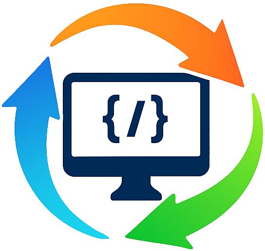

# VersaDumps Visualizer



## 📋 Descripción

VersaDumps Visualizer es una aplicación de escritorio para visualizar y depurar datos, principalmente de aplicaciones backend (como PHP). La aplicación inicia un servidor HTTP local que escucha payloads JSON entrantes y los muestra en una interfaz interactiva en tiempo real.

## ✨ Características principales

- 🌓 Temas claro y oscuro
- 🔄 Visualización de logs en tiempo real con controles de ordenación (más recientes/más antiguos primero)
- 🗑️ Posibilidad de borrar todos los logs o eliminarlos individualmente
- 📊 Exploración interactiva de datos JSON anidados
- 📱 Diseño responsive con enfoque mobile-first
- 🔍 Título de ventana dinámico que muestra el número de mensajes recibidos

## 🧰 Stack tecnológico

- **Backend**: Go
- **Framework de escritorio**: Wails v2
- **Frontend**: Vue.js 3 + Tailwind CSS
- **Herramienta de build**: Vite
- **Configuración**: YAML (`config.yml`)

## 📁 Estructura del proyecto

```
/versaDumps
├── app/
│   ├── build/bin/
│   │   ├── app.exe       # Ejecutable final
│   │   └── config.yml    # Configuración en tiempo de ejecución
│   ├── frontend/
│   │   ├── src/
│   │   │   ├── components/ # Componentes Vue reutilizables
│   │   │   │   ├── Icon.vue
│   │   │   │   ├── LogItem.vue
│   │   │   │   ├── JsonTreeView.vue
│   │   │   │   └── JsonTreeViewNode.vue
│   │   │   ├── App.vue     # Componente principal de Vue
│   │   │   └── main.js     # Inicialización de la app Vue
│   │   ├── index.html
│   │   ├── package.json
│   │   └── vite.config.js
│   ├── app.go
│   ├── config.go
│   ├── go.mod
│   ├── main.go
│   └── server.go
└── README.md
```

## 📊 Estructura de datos

La aplicación espera un payload JSON con la siguiente estructura:

```json
{
  "frame": {
    "file": "/ruta/al/archivo.php",
    "line": 123,
    "function": "miFuncion"
  },
  "context": "{\"clave\":\"valor\"}" 
}
```

- `frame`: Objeto que contiene la ubicación del código fuente.
- `context`: Una **cadena** que contiene un objeto JSON para inspección detallada.

## 🚀 Cómo construir y ejecutar

### Desarrollo

1. Navega al directorio `app`
2. Ejecuta `wails dev`
   - Esto proporciona recarga en caliente y es ideal para realizar cambios

### Producción

1. Navega al directorio `app`
2. Ejecuta `wails build`
   - Esto crea el ejecutable final y autónomo `.exe` en el directorio `app/build/bin`

### Ejecución

1. Coloca `config.yml` en el mismo directorio que `app.exe`
2. Ejecuta el archivo ejecutable

## 🔧 Configuración

El archivo `config.yml` permite configurar:

```yaml
# Ejemplo de configuración
server:
  port: 8080  # Puerto en el que escuchará el servidor HTTP
```

## 💻 Interfaz de usuario

La interfaz de usuario está construida con Vue.js 3 y utiliza componentes para una arquitectura modular:

- **App.vue**: Componente principal que mantiene el estado de la aplicación
- **LogItem.vue**: Muestra una entrada de log individual
- **JsonTreeView.vue** y **JsonTreeViewNode.vue**: Trabajan juntos para renderizar el contexto JSON explorable

## 🤝 Contribución

Las contribuciones son bienvenidas. Por favor, asegúrate de seguir las mejores prácticas de código y añadir pruebas para las nuevas funcionalidades.

## 📄 Licencia

Este proyecto está licenciado bajo [Licencia MIT](LICENSE).